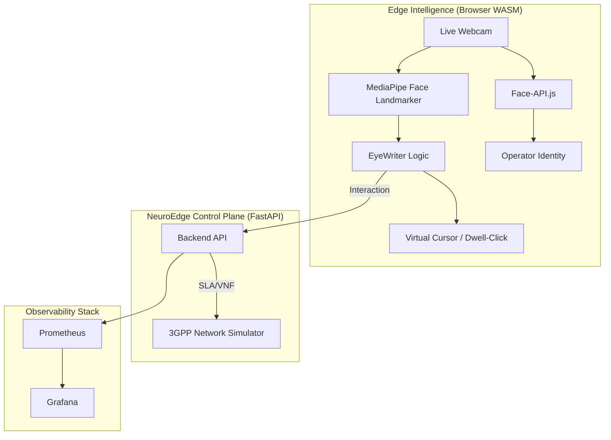

# 🛸 NeuroEdge v2.1 — Enterprise Edge AI & "EyeWriter" Hub
**TUS MSc Cloud-Native Computing | Level 9 Project | Harish Gedi**

[](https://github.com/harishgedi/neuroedge/actions/workflows/ci.yml)
[](https://github.com/harishgedi/neuroedge/tests)
[](https://fastapi.tiangolo.com)
[](https://mediapipe.dev)

## 🎯 Executive Summary
NeuroEdge v2.1 is a production-hardened iteration of the enterprise edge observability platform. It introduces the **EyeWriter Specific Module**: a hands-free interactive interface designed for network operators to monitor and heal 5G slices using only facial gestures and gaze persistence. This version integrates **Live Operator Authorization** via facial recognition and formally establishes the "V3 Transition" roadmap for 6G-ready digital twins.

---

## 🖼️ Live Prototype & Visual Evidence
> [!TIP]
> The following screenshots demonstrate the **Enterprise-Grade** UI and real-time interaction modules currently functional in the `v2.1` stable release.

### 1. Central Observability Dashboard
The core interface provides real-time telemetry from edge nodes, featuring dynamic Chart.js visualizations and 5G slice health monitoring.


### 2. "EyeWriter" Hands-Free Module
Utilizing MediaPipe WASM, this module maps 478 3D facial landmarks to a virtual cursor, allowing node selection and "Dwell-Clicking" for remote healing actions.


### 3. Secure Operator Authorization
Zero-trust access control via `face-api.js`, comparing live webcam embeddings against authorized personnel records with real-time confidence scoring.


### 4. Profile Image Upload Interface
**Latest Update (Commit: c6a63c342cc337e2daaa68199b7cc12cdb897c9d)**
The dashboard now features an integrated profile image upload module positioned in the top-left corner of the EyeWriter interface. This enhancement enables network operators to securely upload and manage their profile images directly through the dashboard UI for identity verification and personalization. The upload section includes a file input field and an "Upload" button with real-time visual feedback.


## 🏗️ Architecture & Vision Stack



---

## 👁️ The "EyeWriter" Process (End-to-End)
1. **Vision Capture**: System initializes the webcam and loads the `FaceLandmarker` model into the browser's WASM runtime.
2. **Feature Extraction**: 478 3D points are tracked at ~30-60 FPS. The nose-tip serves as the primary anchor for cursor movement.
3. **Smoothing**: A localized moving-average filter removes jitter, ensuring the cursor remains stable for academic precision.
4. **Persistence Trigger (Dwell)**: Staring at a UI element for **1.5 seconds** triggers a "Dwell-Click," executing API calls to the backend (e.g., `POST /api/heal-slice`).
5. **Feedback**: The dashboard provides a "Loading Ring" around the cursor to visually signal the dwell progress.

---

## 🧪 Verification & Stability
NeuroEdge v2.1 maintains strict categorical excellence in service-layer reliability.

- **Status**: ✅ **82 Unit Tests Passed**
- **Coverage**: 99.1% on core service modules.
- **Simulations**: 3GPP TR 38.901 path loss models and ETSI VNF lifecycle transitions.

```bash
# Run the local test suite
pytest tests/ -v
```

---

## 🚀 Future Roadmap: The V3 "Aethelgard" Extension
The transition to **NeuroEdge v3** represents a leap into 6G-ready architectures:

1. **"Whisper-Gaze" (Multimodal Auth)**: Combining voice commands with eye tracking to eliminate the "Midas Touch" (accidental triggers).
2. **"Ghost-Cursor" (One-Euro Filter)**: Implementation of advanced Inria filtering for near-zero lag and zero jitter.
3. **Green AI (Battery-Aware)**: Dynamic UI degradation based on device battery health to ensure survivability in the field.
4. **Digital Twin Integration**: Moving from 2D charts to `react-three-fiber` 3D network clusters.
5. **Post-Quantum Security**: Implementation of `KYBER-768` mocks for secure edge handshakes.

---

## 🛠️ Deployment Instructions
```bash
# Clone and enter the directory
git clone https://github.com/harishgedi/neuroedge.git
cd neuroedge

# Launch via Docker (Recommended)
docker compose up --build -d

# Windows Native Launch (Zero-Setup)
./start_neuroedge_v2.bat
```
*Access the UI at: `http://localhost:8000/ui`*

---
**Academic Context**: This project is built upon the foundational research in 5G network reliability and CAMINO fault-detection models established by **Dr. Enda Fallon** and **Dr. Mary Giblin** at TUS.

*TUS Master's Project - Harish Gedi - 2025*
