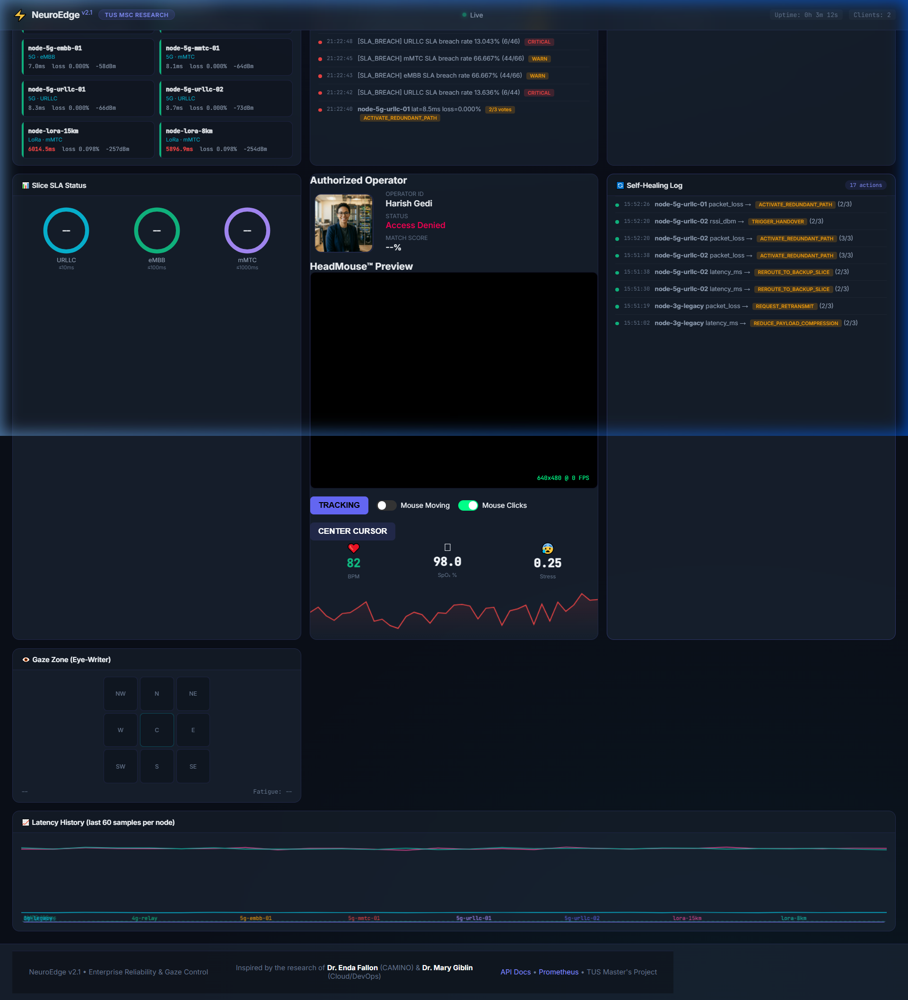
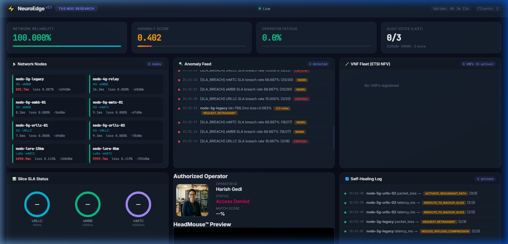

# 🛸 NeuroEdge v2.1 — Enterprise Edge AI & "EyeWriter" Hub
**TUS MSc Cloud-Native Computing | Level 9 Project | Harish Gedi**

[](https://github.com/harishgedi/neuroedge/actions/workflows/ci.yml)
[](https://github.com/harishgedi/neuroedge/tests)
[](https://fastapi.tiangolo.com)
[](https://mediapipe.dev)

## 🎯 Executive Summary
NeuroEdge v2.1 is a production-hardened iteration of the enterprise edge observability platform. It introduces the **EyeWriter Specific Module**: a hands-free interactive interface designed for network operators to monitor and heal 5G slices using only facial gestures and gaze persistence. This version integrates **Live Operator Authorization** via facial recognition and formally establishes the "V3 Transition" roadmap for 6G-ready digital twins.

---

## 🖼️ Live Prototype & Visual Evidence
> [!TIP]
> The following screenshots demonstrate the **Enterprise-Grade** UI and real-time interaction modules currently functional in the `v2.1` stable release.

### 1. Central Observability Dashboard
The core interface provides real-time telemetry from edge nodes, featuring dynamic Chart.js visualizations and 5G slice health monitoring.


### 2. "EyeWriter" Hands-Free Module
Utilizing MediaPipe WASM, this module maps 478 3D facial landmarks to a virtual cursor, allowing node selection and "Dwell-Clicking" for remote healing actions.


### 3. Secure Operator Authorization
Zero-trust access control via `face-api.js`, comparing live webcam embeddings against authorized personnel records with real-time confidence scoring.


### 4. Profile Image Upload Interface
**Latest Update (Commit: c6a63c342cc337e2daaa68199b7cc12cdb897c9d)**
The dashboard now features an integrated profile image upload module positioned in the top-left corner of the EyeWriter interface. This enhancement enables network operators to securely upload and manage their profile images directly through the dashboard UI for identity verification and personalization. The upload section includes a file input field and an "Upload" button with real-time visual feedback.


---

## 🏗️ Architecture & Vision Stack

```mermaid
graph TD
*TUS Master's Project - Harish Gedi - 2025*
